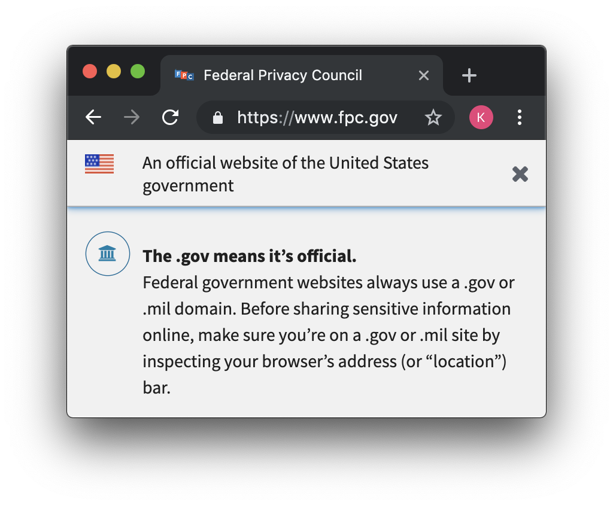

# Our Vulnerable (Dot)Government

Lara Teich, Nari Johnson, Katherine Lou

A survey of vulnerabilities in .gov domains. Final project for GOV 1430: Tech Science to Save the World at Harvard University, Spring 2019.

# Organization

`data` includes raw data downloaded from the DotGov registrar as well as all shodan output

`results` contain all of our quantitative data

`visuals` contain all of our graphs, maps, and other graphics

The home directory contains most of our helper code.

The abandonedmines.gov case study is not included in this repo for security reasons.

# Acknowledgements

Many thanks to Professor Latanya Sweeney, Jinyan Zang, and Ji Su Yoo

Inspired by [nannal](https://github.com/nannal) and [James Sawyer](http://www.jamessawyer.co.uk/)'s [previous work in the UK](https://github.com/nannal/GovUK-CVE)
